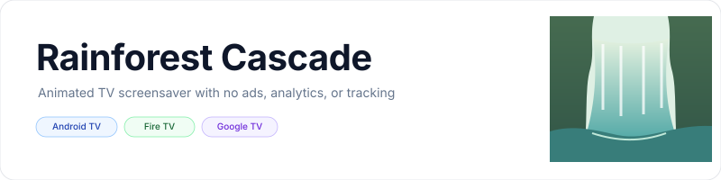
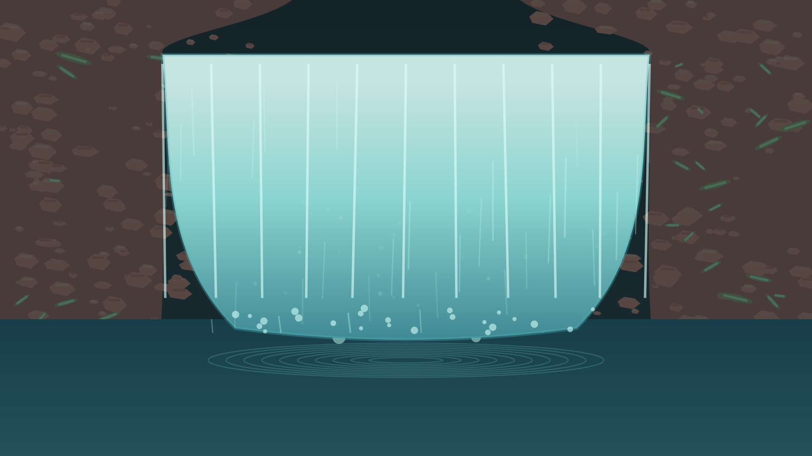
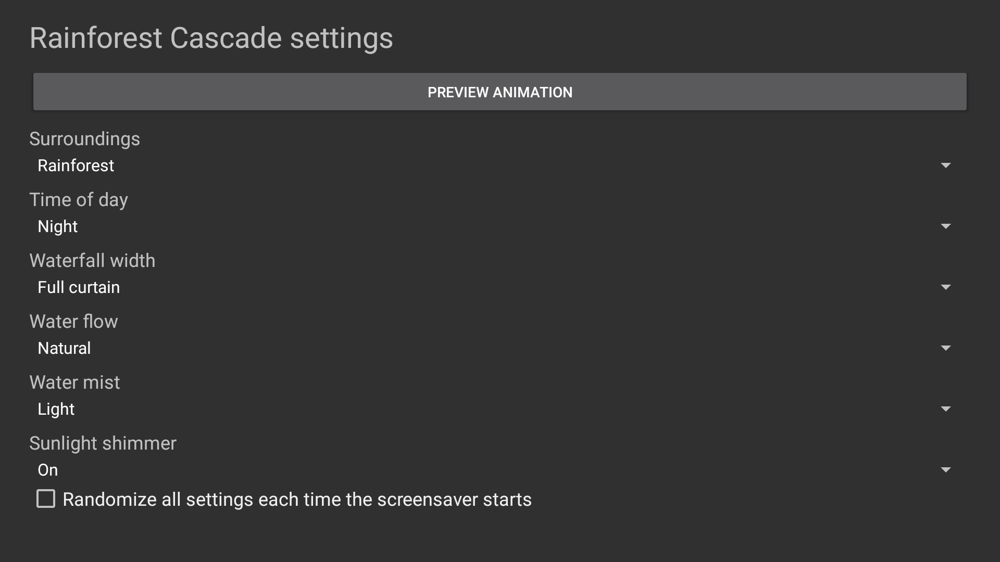

<p align="center">
    <picture>
        <source media="(prefers-color-scheme: dark)" srcset="art/banner-dark.svg">
        <source media="(prefers-color-scheme: light)" srcset="art/banner-light.svg">
        
    </picture>
</p>

<p align="center">An animated waterfall screensaver for Fire TV, Android TV, and Google TV.</p>

<p align="center">
    <a href="https://github.com/jeremykenedy/rainforest-cascade/releases"></a>
    <a href="https://github.com/jeremykenedy/rainforest-cascade/releases"></a>
    <a href="https://github.com/jeremykenedy/rainforest-cascade/actions/workflows/ci.yml"></a>
    <a href="https://github.com/jeremykenedy/rainforest-cascade/actions/workflows/style.yml"></a>
    <a href="https://github.com/jeremykenedy/rainforest-cascade/actions/workflows/docs.yml"></a>
    <a href="https://github.com/jeremykenedy/rainforest-cascade/actions/workflows/security.yml"></a>
    <a href="https://img.shields.io/github/license/jeremykenedy/rainforest-cascade"></a>
    <a href="https://github.com/sponsors/jeremykenedy"></a>
    <a href="https://github.com/jeremykenedy"></a>
    <a href="https://github.com/jeremykenedy/rainforest-cascade/stargazers"></a>
</p>

## Table of Contents

- [Privacy](#privacy)
- [Features](#features)
- [Requirements](#requirements)
- [Installation](#installation)
- [Configuration](#configuration)
- [Screenshots](#screenshots)
- [Building and testing](#building-and-testing)
- [Documentation](#documentation)
- [Changelog](#changelog)
- [License](#license)

## Privacy

The app has no ads, analytics, telemetry, diagnostics, crash reporting, or tracking. It requests no network permission and makes no network requests. Settings remain on the device. The optional command-line installer contacts GitHub only when you explicitly ask it to download a release; it sends no TV or usage data.

## Features

- A continuously animated waterfall, flowing water, moving pool ripples, and rising mist.
- Rainforest, mossy stone, and red canyon environments.
- Day or night lighting, with optional moving sunlight shimmer.
- Narrow, curtain, and wide waterfall shapes.
- Slow, natural, and fast water flow.
- Mist amount, per-setting random choices, and a master random mode.
- Remote-friendly settings and an app-owned settings provider for host interfaces.
- No bundled stock footage or third-party visual assets.

## Requirements

| Device | Minimum | Tested |
| --- | --- | --- |
| Fire TV | Fire OS 7 / Android API 28 | Fire OS 11, API 30, AFTDEC012E |
| Android TV | Android 6.0 / API 23 | Not tested on a physical Android TV device |
| Google TV | Android 6.0 / API 23 | Not tested on a physical Google TV device |

The project targets Android API 36. The animation uses a native Canvas at the display's available logical resolution. A 4K panel alone does not establish native 4K composition.

## Installation

Connect the TV to ADB and run the guided installer. It downloads the latest stable release, verifies the published SHA-256 checksum, and installs or updates the app.

```bash
python3 install.py --serial TV_IP:5555
```

Install a locally built APK with `python3 install.py --serial TV_IP:5555 --apk build/rainforest-cascade.apk`. To remove the app and its settings, run `python3 install.py --serial TV_IP:5555 --uninstall`. Unattended removal requires `--uninstall --yes --force`. The installer does not change the TV's screensaver selection, timers, sleep behavior, or system update settings. Select Rainforest Cascade in the device's screensaver settings after installation.

## Configuration

Open Rainforest Cascade from the TV launcher to update settings. Changes apply the next time the screensaver starts. For supported options, defaults, and the host settings-provider schema, see [configuration](docs/CONFIGURATION.md).

## Screenshots

Images show the running preview and settings app on the Fire TV listed above. The preview and settings screens were device-tested; Fire OS did not provide a supported way to activate the app as the system DreamService during verification. The images contain no scene text or watermark.

<p align="center">
  
  
  
</p>

## Building and testing

Use Android SDK platform 36 and build-tools 36.0.0. The first build creates a unique signing key in `~/.android/`; keep it secure and back it up for future signed updates.

```bash
bash build.sh
bash test.sh
bash scripts/test-python-coverage.sh
bash scripts/test-coverage.sh
python3 scripts/check-docs.py
python3 scripts/check-privacy.py
bash scripts/check-style.sh
```

The Java coverage gate is 100% line and branch coverage for the project-owned settings and option-resolution logic. Android framework integration and Canvas drawing are verified on device and are outside host JaCoCo coverage. The Python installer is gated at 100% line and branch coverage.

## Documentation

- [Architecture](docs/ARCHITECTURE.md)
- [Building](docs/BUILDING.md)
- [CI](docs/CI.md)
- [Configuration](docs/CONFIGURATION.md)
- [Installation](docs/INSTALLATION.md)
- [Releasing](docs/RELEASING.md)
- [Testing](docs/TESTING.md)
- [Troubleshooting](docs/TROUBLESHOOTING.md)
- [Verification and device results](docs/VERIFICATION.md)
- [Version 1.0.0 release notes](docs/releases/v1.0.0.md)

## Changelog

See the [changelog](CHANGELOG.md) for the release history.

## License

Rainforest Cascade is licensed under the [Apache License, Version 2.0](LICENSE). See [NOTICE](NOTICE) for project notices.

Show some love by starring this repository on GitHub: [Star Rainforest Cascade](https://github.com/jeremykenedy/rainforest-cascade/stargazers).
